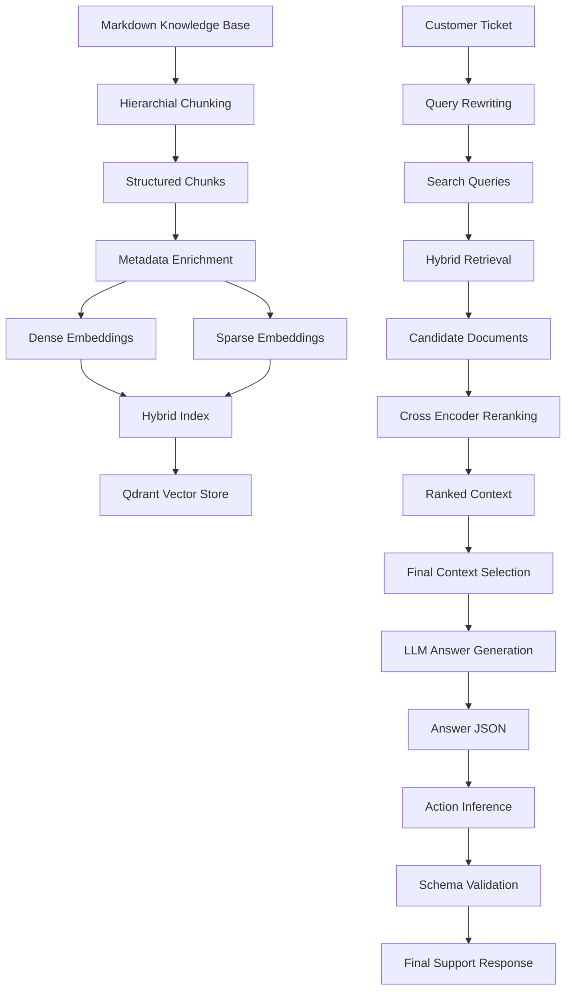

# 🧠 Support Knowledge Assistant (RAG + MCP)

A **production-grade Retrieval-Augmented Generation (RAG) system** for resolving customer support tickets using **structured knowledge**, **hybrid retrieval**, and **deterministic action inference**.

This system is designed for **real-world support operations**, providing grounded answers, explicit references, and predictable escalation behavior—without relying on fragile, end-to-end LLM reasoning.

---

## 🚀 Overview

The Support Knowledge Assistant ingests internal markdown documentation (FAQs, policies, runbooks) and exposes a FastAPI service that resolves customer support tickets end-to-end.

For every ticket, the system returns:
- ✅ A **clear, accurate answer** grounded in retrieved documentation  
- 📎 **Top-K document references** for auditability  
- ⚠️ A **deterministic action recommendation** (follow-up, escalation, or customer action)

The knowledge base is **fully dynamic**—documents can be updated or replaced without retraining any model.

---

## ✨ Key Capabilities

- Hybrid retrieval (**dense + BM25 sparse**) using Qdrant  
- Cross-encoder reranking for high-precision relevance  
- Query rewriting for retrieval robustness  
- Deterministic action inference via semantic similarity  
- MCP-style structured responses with strict schema validation  
- Provider-agnostic LLM interface (OpenAI)  
- Docker-ready for production deployment  
- Streamlit version of the app is also available

---

## 🏗️ System Architecture



---

## 🧩 Core Design Principles

### 1. Retrieval Before Generation
The LLM never answers blindly. All responses are generated **only after retrieving and ranking relevant documentation**.

### 2. Deterministic Actions (No LLM Guessing)
Escalation and follow-up decisions are **not generated by the LLM**.  
They are inferred using semantic similarity against curated action prototypes.

### 3. Strict Output Contracts
All outputs are validated using **Pydantic schemas**.  
Malformed or hallucinated responses fail fast.

### 4. Purposeful Model Selection (Why gpt-4o-mini)

The system uses gpt-4o-mini by design—not as a default.
We chose this model because:
- Strong instruction-following for strict JSON-only generation
- Low latency and cost, suitable for high-volume support workloads
- Sufficient reasoning capability when paired with high-quality retrieved context
- Reliability over creativity, which is critical for customer support systems
- Because retrieval, validation, and action inference are handled outside the model, the system does not require a large or creative LLM—only a consistent, controllable generator.
---

## ⚙️ Technology Stack

| Layer | Technology |
|-----|-----------|
| API | FastAPI |
| LLM | OpenAI (default) |
| Retrieval | Qdrant (Hybrid Dense + Sparse) |
| Dense Embeddings | all-MiniLM-L6-v2 |
| Sparse Search | BM25 |
| Reranking | Cross-Encoder (ms-marco-MiniLM-L-6-v2O) |
| Validation | Pydantic (MCP-style schemas) |
| Deployment | Docker |

---

## 📁 Repository Structure

```text
interview-exercise-rag/
├── artifacts/
│   └── langchain_chunks.txt        # Auditable output of markdown chunking
│
├── data/                           # Knowledge base (source of truth)
│   ├── faqs/                       # Frequently asked questions
│   ├── policies/                   # Policy documents
│   └── runbooks/                   # Operational runbooks
│
├── src/
│   └── rag/
│       ├── __init__.py
│       ├── action_classifier.py    # Deterministic action inference (semantic)
│       ├── chunking.py             # Header-aware markdown chunking
│       ├── embedding.py            # Dense + sparse embedding & indexing
│       ├── generation.py           # MCP-compliant answer generation
│       ├── llm_client.py           # Unified OpenAI / Ollama client
│       ├── prompts.py              # Prompt templates (generation, rewrite)
│       ├── query_rewriter.py       # Retrieval-optimized query rewriting
│       ├── rag_pipeline.py         # End-to-end RAG orchestration
│       ├── references.py           # Stable, human-readable references
│       ├── retriever.py            # Hybrid retrieval + reranking
│       ├── schemas.py              # Strict Pydantic MCP schemas
│       └── main.py                 # FastAPI application entrypoint
│
├── tests/                          # Unit and integration tests
├── venv/                           # Local virtual environment (not committed)
│
├── .env                            # Environment variables (local)
├── app.py                          # Streamlit app entry (if used externally)
├── docker-compose.yml              # Local multi-service orchestration
├── Dockerfile                      # Production container build
├── pytest.ini                      # Pytest configuration
├── requirements.txt                # Python dependencies
└── README.md                       # Project documentation
```

---

## 🔄 End-to-End Ticket Flow

1. Ticket rewriting into retrieval-optimized queries  
2. Hybrid dense + sparse retrieval from Qdrant  
3. Cross-encoder reranking with relevance scoring  
4. Context-grounded LLM answer generation  
5. Deterministic action inference  
6. MCP schema validation  

---

## 🔧 Installation & Setup

### Clone the Repository
```bash
git clone https://github.com/Sindhuja217/interview-exercise-rag.git
cd interview-exercise-rag
```

### Run with Docker
```bash
# Start all services 
docker compose up --build

# View logs
docker compose logs -f

# Stop all services
docker compose down
```
Once the server is up and running, open the following URL in your browser to access the interactive session:

👉 http://0.0.0.0:8000/docs
- Submit support tickets
- Inspect request/response schemas
- Test the RAG pipeline end-to-end


### Run with Streamlit
```bash
streamlit run app.py
```

---

## 🌐 API Endpoints

### Health Check
```bash
GET /health
```

### Resolve Support Ticket
```bash
POST /resolve-ticket
```

Request:
```json
{
  "ticket_text": "My domain was suspended yesterday. How do I reactivate it?"
}
```

Response:
```json
{
  "answer": "Your domain may have been suspended due to an abuse report...",
  "references": [
    "runbooks: Domain Suspension § Abuse Review | file=runbooks/domain_suspension.md"
  ],
  "action_required": "escalate_to_abuse_team"
}
```
Sample questions are provided in `questions.md` file.

---

#### Copy the example environment file and change the file name to `.env`

```bash
cp .env.example .env
```

## 🧪 Running Tests

### 1. Activate Python environment
```bash
python3 -m venv .venv
source venv/bin/activate 
```

### 2. Install dependencies
```bash
pip install -r requirements.txt
```

### 3. Run test suite
```bash
pytest
```
### 4. Copy the example environment file and fill the credentials to run the code

```bash
cp .env.example .env
```
---

## 🔒 Reliability Guarantees

- No hallucinated escalations  
- No undocumented actions  
- Max 3 references enforced  
- Schema-validated responses only  

---

## 👤 Author

**Sindhuja Chaduvula**  
*Machine Learning Specialist, Vector Institute*
📧 sindhu.chaduvula.21@gmail.com
🔗 [LinkedIn](https://www.linkedin.com/in/sindhuja-chaduvula/) | [Portfolio](https://sindhuja217.github.io/sindhujachaduvula/)
